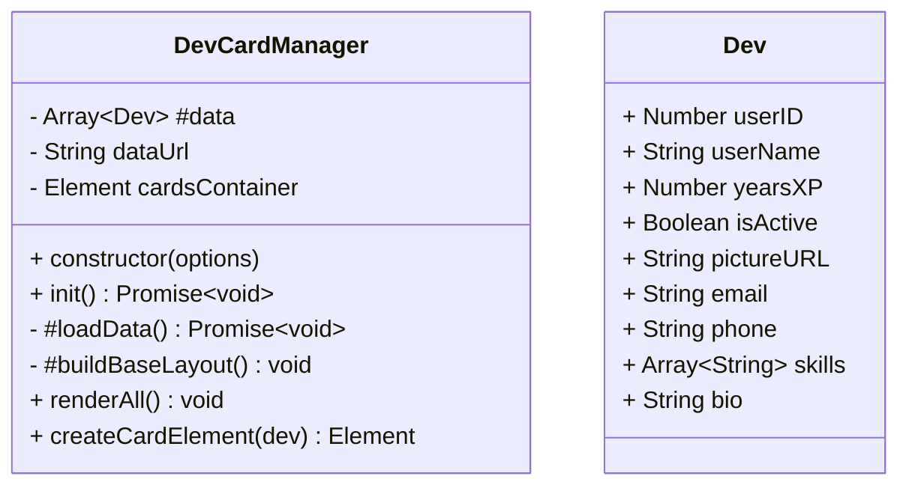

# OOP Dev Data Card Generator

Reads `devData.json` from the filesystem (Node `fs`), serves it at `/api/devs`, and renders developer cards dynamically in the browser using OOP JavaScript.

## How to Run
```bash
# Install dependencies (optional, for fontawesome if local)
npm init -y

# Start server
node server.js

# Open in browser
http://localhost:3000
```

## Deliverables
- Pure JS rendering (no HTML elements hardcoded in index.html).
- JSON data loaded with `fs` on backend.
- OOP class (`DevCardManager`) builds cards dynamically.

## UML Diagram

